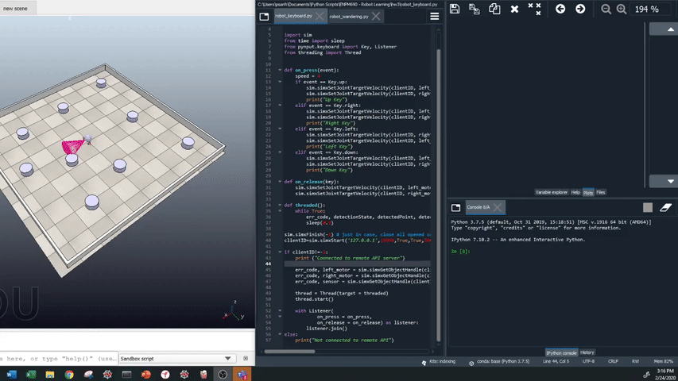

# Robo_Sphere
ENPM690 - Robot Learning HW3

## Dependencies

- Make sure sim is imported (V-Rep API Library)

- Install pynput library for keyboard commands. Follow link [here](https://pypi.org/project/pynput/)

## Robot Controlled by Keyboard (robot_keyboard.py)

You can also check the MP4 video in the Videos_Gifs folder

## Robot Avoiding Obstacles (robot_wandering.py)

You can also check the MP4 video in the Videos_Gifs folder

